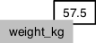
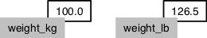

```{r, include = FALSE}
knitr::opts_chunk$set(fig.width=4, fig.height=4, fig.path = "fig/start-")
```

# Starting out in R

Working with R is primarily text-based. The basic mode of use for R is that the user types in a command in the R language and presses enter, and then R computes and displays the result.

We will be working in [RStudio](https://www.rstudio.com/). This surrounds the *console*, where one enters commands and views the results, with various conveniences. In addition to the console, RStudio provides panels containing:

* A *text editor*, where R commands can be recorded for future reference.
* A history of commands that have been typed on the console.
* A list of *variables*, which contain values that R has been told to save from previous commands.
* A file manager.
* Help on the functions available in R.
* A panel to show plots (graphs).

Open RStudio, click on the "Console" pane, type `1+1` and press enter. R displays the result of the calculation. In this document, we will be showing such an interaction with R as below.

```{r}
1+1
```

`*` has higher precedence than `+`.  We can use brackets if necessary `( )`. Try `1+2*3` and `(1+2)*3`.

Spaces can be used to make code easier to read.

We can compare with `== < > <= >=`. This produces a "logical" value, `TRUE` or `FALSE`. Note the double equals, `==`, for equality comparison.

There are also character strings such as `"string"`.


## Variables

A variable is a name for a value, such as `x`, `current_temperature`, or `subject_id`.
We can create a new variable by assigning a value to it using `<-`

```{r}
weight_kg <- 55
```

RStudio helpfully shows us the variable in the "Environment" pane. We can also print it by typing the name of the variable and hitting `Enter` (or `return`).
In general, R will print to the console any object returned by a function or operation *unless* we assign it to a variable.

```{r}
weight_kg
```

Examples of valid variables names: `hello`, `hello_there`, `hello.there`, `value1`. Spaces aren't ok *inside* variable names. Dots (`.`) are ok, unlike in many other languages.

We can do arithmetic with the variable:

```{r}
# weight in pounds:
2.2 * weight_kg
```

> ### Tip {.callout}
>
> We can add comments to our code using the `#` character. It is useful to
> document our code in this way so that others (and us the next time we
> read it) have an easier time following what the code is doing.

We can also change an object's value by assigning it a new value:

```{r}
weight_kg <- 57.5
# weight in kilograms is now
weight_kg
```

If we imagine the variable as a sticky note with a name written on it,
assignment is like putting the sticky note on a particular value:



This means that assigning a value to one object does not change the values of other variables.
For example, let's store the subject's weight in pounds in a variable:

```{r}
weight_lb <- 2.2 * weight_kg
# weight in kg...
weight_kg
# ...and in pounds
weight_lb
```


and then change `weight_kg`:

```{r}
weight_kg <- 100.0
# weight in kg now...
weight_kg
# ...and weight in pounds still
weight_lb
```



Since `weight_lb` doesn't "remember" where its value came from, it isn't automatically updated when `weight_kg` changes.
This is different from the way spreadsheets work.


## Vectors

We can make vectors with `c( )`, for example `c(1,2,3)`, and do maths to them. `c` means "combine". Actually in R, values are just vectors of length one. R is obsesssed with vectors.

```{r}
myvec <- c(1,2,3)
myvec + 1
myvec + myvec
c(10, myvec)
```

Access elements of a vector with `[ ]`, for example `myvec[1]`.

We will also encounter character strings, for example `"hello"`. R also has something called "factors", which are categorical vectors, and behave very much like character vectors (think the factors in an experiment). R likes turning character vectors into factors, which is usually fine.

## Functions

R has various functions, such as `sum( )`. We can get help on a function with, eg `?sum`.

```
?sum
```

```
sum( c(1,2,3) )
```

Because R is a language for statistics, it has many built in statistics-related functions. We will also be loading more specialized functions from "libraries" (also known as "packages").

Functions take some number of *arguments*. Lets look at the function `rep`, which means "repeat", and which can take a variety of different arguments. In the simplest case, it takes a value and the number of times to repeat that value.

```{r}
rep(42, 10)
```

As with many functions in R, which is obsessed with vectors, the thing to be repeated can be a vector with multiple elements.

```{r}
rep(c(1,2,3), 10)
```

So far we have used *positional* arguments, where R determines which argument is which by the order in which they are given. We can also give arguments by *name*. For example, the above is equivalent to

```{r}
rep(c(1,2,3), times=10)
rep(x=c(1,2,3), 10)
rep(x=c(1,2,3), times=10)
```

Arguments can have default values, and a function may have many different possible arguments that make it do obscure things. For example, `rep` can also take an argument `each=`. It's typical for a function to be invoked with some number of positional arguments, which are always given, plus more rarely used arguments, typically given by name.

```{r}
rep(c(1,2,3), each=3)
rep(c(1,2,3), each=3, times=5)
```


## Lists

Vectors contain all the same kind of thing. Try `c(42, "hello")`. Lists can contain different kinds of thing.

We generally gives the things in a list names. Try `list(num=42, greeting="hello")`. To access named elements we use `$`.

```{r}
mylist <- list(num=42, greeting="Hello, world")
mylist$greeting
```

I'm skipping a lot of details here.

This terminology is peculiar to R. Other languages make the same distinction they may use different words for vectors and lists.

If you're not sure what sort of object you are dealing with you can use `class`, or for more detailed information `str` (structure).
